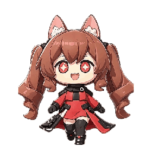

# 洁尔佩塔桌宠（Gilberta Desktop Pet）

<p align="center">
  
</p>

《明日方舟：终末地》洁尔佩塔 Q 版桌面宠物。一只常驻在你桌面角落的狐耳小姑娘：
**画面 1:1 取自官方风格立绘**（抠图切件、原样拼合，不做手绘改造），会呼吸、眨眼、
摇尾巴，按一下 <kbd>Q</kbd> 就给你表演一段小动作。免费开源（MIT），面向 Windows。

---

## 它能做什么

- **常驻桌面**：透明背景、窗口置顶（可关），不挡任何桌面操作；鼠标移到角色身上才能点住它
- **三个小动作**：按 <kbd>Q</kbd> 交替播放「踢腿」「害羞捂脸」（闭眼、脸红、耳朵耷拉）
  和「开心」（视频同款的原地欢快步，约 6 秒）
- **待机也有戏**：呼吸起伏、随机眨眼、狐尾轻摆、狐耳抖动，偶尔歪头，偶尔自己害羞一下
- **随手拖走**：按住拖到屏幕任意位置，松手还会晃两下才站稳
- **状态记忆**：位置、大小、置顶、Q 键开关，重启后原样恢复

## 30 秒上手

1. **装 Node.js**：去 [nodejs.org](https://nodejs.org/) 下载 LTS 版，一路下一步
2. **下载本项目**：点本页上方绿色 **Code → Download ZIP**，解压到任意文件夹
   （会用 git 的话也可以 `git clone`）
3. **安装依赖**：在项目文件夹里打开终端（地址栏输 `cmd` 回车），执行：
   ```bat
   npm install
   ```
   国内网络下载 Electron 较慢时，先执行下面这句再 `npm install`：
   ```bat
   set ELECTRON_MIRROR=https://npmmirror.com/mirrors/electron/
   ```
4. **启动**：双击 **启动桌宠.bat**，或终端里 `npm start`

不想养了？托盘区（屏幕右下角）找到狐狸头图标 → **退出**。

## 玩法一览

| 操作 | 反应 |
| --- | --- |
| <kbd>Q</kbd> 键 | **交替触发三个动作**：踢腿 → 害羞捂脸 → 开心 → 踢腿……循环切换 |
| 按住拖动 | 角色跟着鼠标走，身体随速度倾斜，松手后晃两下站稳 |
| 静静看着 | 呼吸、眨眼、尾巴飘、耳朵抖，偶尔歪头，低概率自己害羞捂一次脸 |
| 托盘图标 | 缩放 256↔512、窗口置顶开关、Q 键开关、退出 |
| 其余桌面区域 | 完全穿透，点不到、挡不着 |

### 关于 Q 键，一定要知道的事

Q 是**全局热键**：只要桌宠开着，你在**任何程序里**（聊天框、浏览器、文档）按 Q
都会触发动作，而且这个按键会被桌宠“吃掉”，不会输入到那个程序里。

> 所以需要打字的时候，右键托盘狐狸头 → 取消勾选「键盘 Q 切换表情（全局）」，
> 打完字再勾回来就行。这个开关会自动记住。

### 找不到桌宠了？

- 看看托盘区有没有狐狸头图标，点它可以缩放（256 / 512）、置顶、退出
- 位置跑丢了的话，删除配置文件可重置到初始位置：
  `%APPDATA%\gilberta-desktop-pet\pet-config.json`

### 老显卡透明异常 / 花屏？

终端里用这条命令启动：`.\node_modules\.bin\electron . --disable-gpu`

---

## 给开发者

<details>
<summary><b>项目结构与素材管线（点开）</b></summary>

```
main.js            主进程：透明置顶窗口、鼠标穿透、托盘、位置记忆、全局 Q 热键
preload.js         IPC 桥接（穿透开关 / 移动窗口 / 截图 / 热键转发）
src/index.html     页面壳
src/renderer.js    纸偶合成渲染 + 动作状态机（idle/kick/drag/shy/happy帧序列）+ 热键循环
tools/             图像处理管线（需 Python + Pillow + numpy，视频管线另需 ffmpeg）
assets/            零件 PNG + 动作帧序列 + manifest.js（由管线生成）
```

**素材从哪来**：一张角色立绘参考图，经 `tools/process.py` 抠图、去水印、按折线切成
可动零件（双马尾 ×2 / 狐耳 ×2 / 双腿 ×2 / 身体底图），并采样出肤色等参数写入
`assets/manifest.json`。渲染端只在“素材像素坐标系”里旋转/平移这些原图零件，
不做任何手绘，所以造型与原图完全一致。

**动作怎么扩展**：

| 想加的东西 | 用什么 |
| --- | --- |
| 换表情贴片 | `tools/face.py` —— 从同角色不同表情的生成图上切脸贴回（命名 `happy` 拖拽时自动使用） |
| 静态姿势动作 | 参考 `tools/shy_align.py`（模板匹配对齐）+ `tools/shy_extract.py`（特征提取）的捂脸图管线 |
| 抬手零件 | `tools/arms.py` —— 从参考图切出前臂+手套并给 base 挖孔修补（害羞捂脸的手由它提供） |
| 视频帧序列动作 | `ffmpeg` 抽帧 → `tools/happy_frames.py` 逐帧去底（灰背景泛洪 + 最大连通域 + 灰尘剔除）并按脚底锚点配准打包（开心动作即此管线，73 帧 / 12fps） |
| 预览 / 演示动图 | `npm run preview` 生成姿势截图与帧序列，`python tools/make_gif.py` 合成 GIF |

**Q 键动作循环**在 `src/renderer.js` 的 `playNextAction()`，想加第三个动作就在那里
加分支；触发方式若想改回鼠标，参考 `renderer.js` 鼠标事件区（右键/单击触发的历史实现）。
</details>

## 许可

[MIT](LICENSE) —— 洁尔佩塔角色设定归《明日方舟：终末地》官方所有，项目内立绘为 AI
生成的同人素材，仅供个人娱乐，请勿商用。
